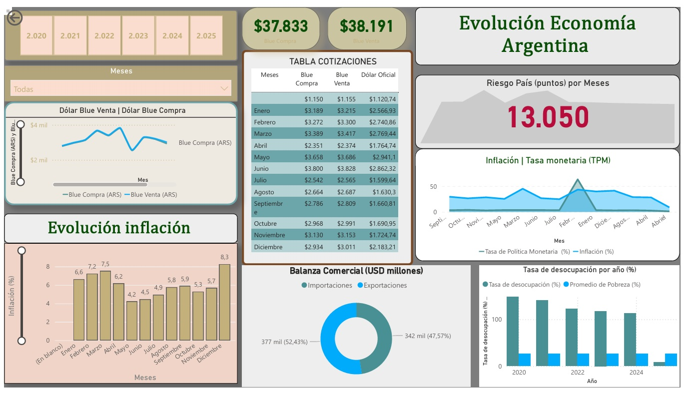
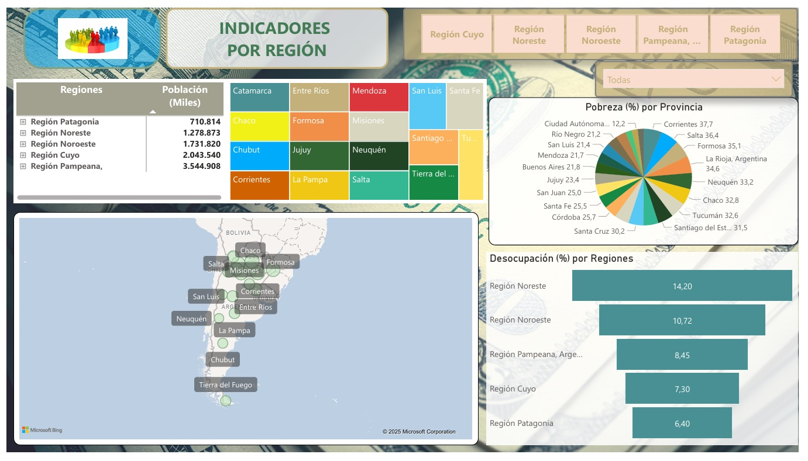

# Economic & Operational Indicators Dashboard

This repository contains a **Power BI** project focused on tracking operational efficiency and financial performance. This dashboard is designed to transform raw data into actionable insights for business management.

##  Project Overview
This dashboard provides a high-level view of key performance indicators (KPIs), allowing stakeholders to monitor the health of the business and the efficiency of its operations.

## Key Insights & Features
* **Economic Performance:** Analysis of costs and revenue trends to ensure project profitability.
* **Operational Efficiency:** Visualization of productivity metrics and resource utilization.
* **Data-Driven Monitoring:** Real-time tracking of goals vs. actual performance.
* **Granular Filters:** Ability to segment data by date, category, or specific business units for deep-dive analysis.

## Technical Skills Demonstrated
* **DAX Excellence:** Implementation of advanced measures for year-to-date (YTD) calculations and performance ratios.
* **Data Modeling:** Optimized star schema to handle large datasets efficiently.
* **Insightful Visualization:** Use of custom charts to highlight deviations and critical trends.

## Repository Content
* **Source File:** `Proyecto_Indicadores_Ec.pbix`
* **Visual Documentation:** High-resolution screenshots showing the dashboard's layout and interactivity.

 

---
*Developed by Mariela Loncharich*
